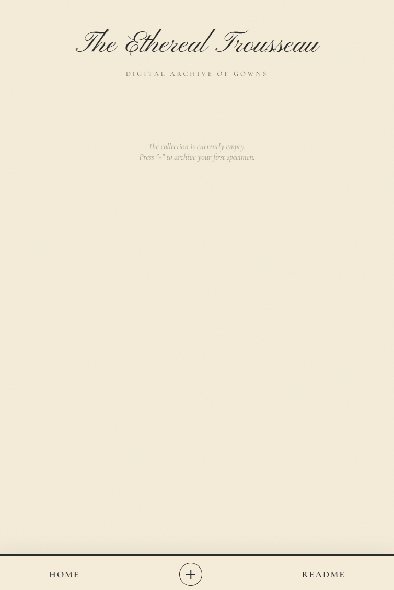

# The Ethereal Trousseau



是一个基于本地 AI 的私有化网络衣柜, 实现了上传衣物照片后自动去除背景、智能裁剪居中、并合成至羊皮纸纹理展示框的全自动化并展示的流程

## 项目结构


储存数据结构(wardrobe_db.json)

```
[
    {
        "id": "uuid",
        "image": "image",
        "raw_image": "raw_image",
        "note": "note"
    },
    {
        "id": "uuid",
        "image": "image",
        "raw_image": "raw_image",
        "note": "note"
    },
    	...
]
```

## 如何运行?

###### 1.准备环境

确保你的电脑上已经安装了 **Python**,并将这个项目克隆下来,并到这个项目的目录下

###### 2.安装依赖库

```
pip install -r requirements.txt
```

###### 3.运行 (初次需要下载模型)

```
python runserver.py
```

如果你看到类似下面的输出，说明启动成功了

```
The Ethereal Trousseau is Online.
Access via PC:   http://localhost:8080
Access via Phone: http://192.168.1.5:8080
```

###### 修改端口:

①编辑run_server.py

②找到`if __name__ == '__main__':` 下面的 `port` 变量

③将 `8080` 改成你想要的数字


>  从后端逻辑、前端 UI 设计到部署脚本，均通过 由 **Google Gemini **编程完成
