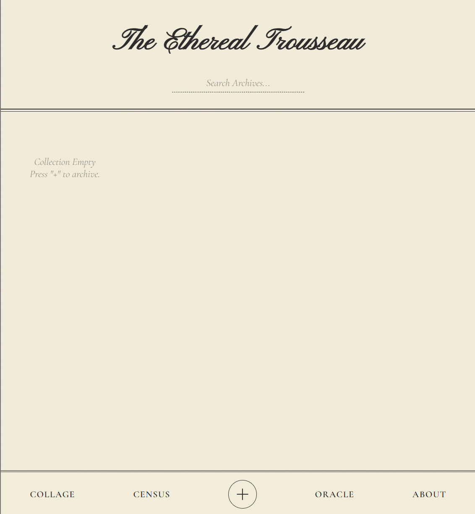
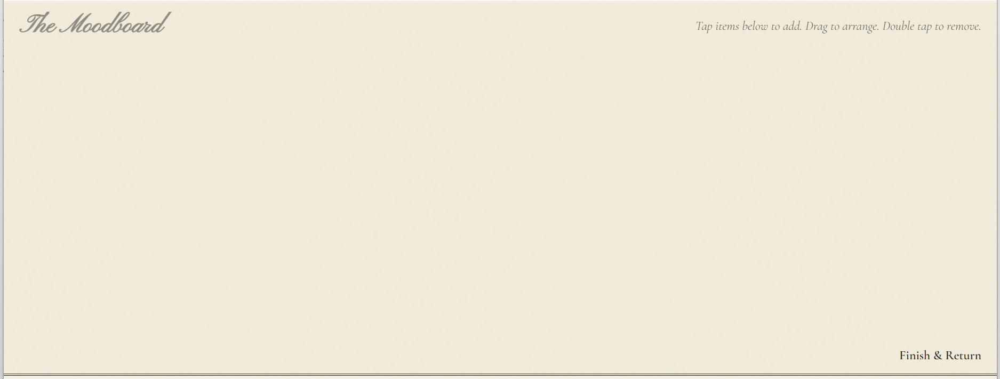

# The Ethereal Trousseau

**The Ethereal Trousseau** 是一个基于本地 AI 运算的私有化数字衣橱，它融合了“新维多利亚”复古美学与现代机器视觉技术，提供从自动去背、色彩分析到穿搭拼贴的全流程沉浸式管理体验。

## 项目结构

```
my_wardrobe/
│
├── run_server.py         # [启动脚本] 局域网运行入口，平时点这个启动
├── app.py                # [核心后端] 包含 AI 抠图、颜色提取、数据库读写逻辑
├── requirements.txt      # [依赖列表] 包含 Flask, rembg, colorgram.py 等库
├── wardrobe_db.json      # [数据库] 自动生成的 JSON 文件，存储所有衣服数据
├── .gitignore            # [Git配置] 防止隐私照片上传到代码仓库
│
├── static/               # [静态资源]
│   ├── uploads/          # (自动生成) 存放上传的原始照片
│   └── clothes/          # (自动生成) 存放去背、居中处理后的成品图
│
└── templates/            # [前端页面]
    ├── index.html        # 主页：画廊、搜索栏、底部导航
    ├── add.html          # 添加页：上传、等待动画
    ├── detail.html       # 详情页：色卡、标签系统、借阅卡日志、删除功能
    ├── stats.html        # 统计页：衣柜数据普查 (Census) + 随机预言 (Oracle)
    ├── collage.html      # 拼贴页：自由穿搭画布 (Canvas)
    └── readme.html       # 关于页：项目宣言 (Manifesto)
```

储存数据结构(wardrobe_db.json)

```
[
    {
        "id": "uuid",
        "image": "image",
        "raw_image": "raw_image",
        "note": "note"
    },
    {
        "id": "uuid",
        "image": "image",
        "raw_image": "raw_image",
        "note": "note"
    },
    	...
]
```

## 如何运行?

###### 1.准备环境

确保你的电脑上已经安装了 **Python**,并将这个项目克隆下来,并到这个项目的目录下

###### 2.安装依赖库

```
pip install -r requirements.txt
```

###### 3.运行 (初次需要下载模型)

```
python run_server.py
```

如果你看到类似下面的输出，说明启动成功了

```
The Ethereal Trousseau is Online.
Access via PC:   http://localhost:8080
Access via Phone: http://192.168.1.5:8080
```

###### 修改端口:

①编辑run_server.py

②找到`if __name__ == '__main__':` 下面的 `port` 变量

③将 `8080` 改成你想要的数字


>  从后端逻辑、前端 UI 设计到部署脚本，均通过 由 **Google Gemini **编程完成
